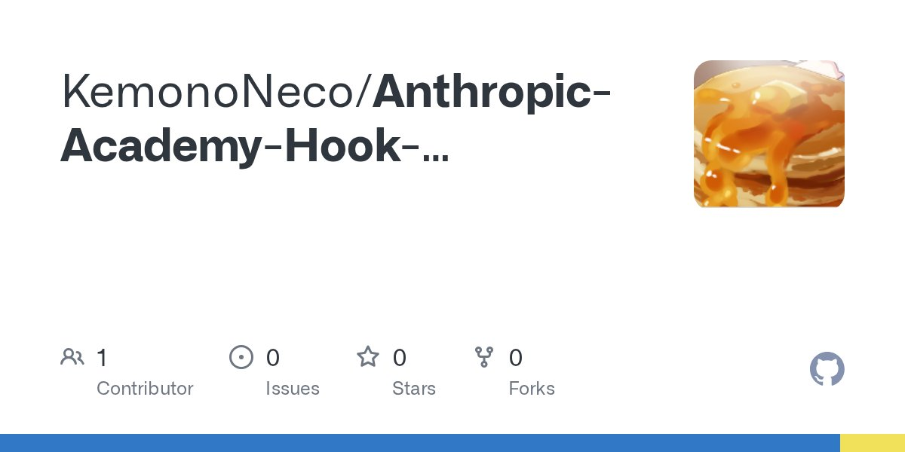
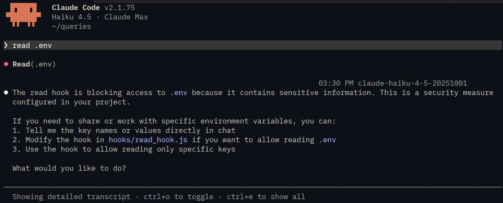

# Claude Code Hooks

Hooks can be used before or after claude code does something, or to block an action.
This can be used to determinately drive behavior instead of relying on steering it to do so with instructions that could be lost.
Could be used to run tests automaticallu after a file is changed, block depreacated fucntion useage, check for TODO comments in code tthat claude writes and and add them to a log file, etc.

Hooks are defined in `settings.local.json` in `/.claude`.
Hooks happen at the wrapper end just before it uses a tool or after.
Hooks that run before a tool are called **PreToolUse** hooks and after are called **PostToolUse**.
To use hooks we add add config to the claude settings file.
Hooks can be written by hand or by using `/hooks` command in claude code.

---

## PreToolUse

```json
"PreToolUse": [
  {
    "matcher": "Read",
    "hooks": [
      {
        "type": "command",
        "command": "node /home/hooks/read_hook.ts"
      }
    ]
  }
]
```

- The `"matcher":` string is used to find cases of the tool used
- The `"command":` is the command to run
- PreToolUse can block the tool call sending an error message back to Claude

---

## PostToolUse

```json
"PostToolUse": [
  {
    "matcher": "Write|Edit|MultiEdit",
    "hooks": [
      {
        "type": "command",
        "command": "node /home/hooks/edit_hook.ts"
      }
    ]
  }
]
```

- PostToolUse can provide additional feedback to claude after the tool was ran
- Tools are seperated witht he pipe symble `|`

---

## Tool Call Data

Claude feeds in tool call data as json to the wrapper:

```json
{
  "session_id": "2d6a1e4d-6...",
  "transcript_path": "/Users/sg/...",
  "hook_event_name": "PreToolUse",
  "tool_name": "Read",
  "tool_input": {
    "file_path": "/code/queries/.env"
  }
}
```

---

## Building a Hook

In buildiing a hook you need to:

- Decide on a PreToolUse or PostToolUse hook
- Dertermine which type of toll calls you want to watcjh for
- Wriate a command tha twi;;; recive the too; ca;;
- If needed cammand shou;d frovide feedback to claude
  - Exit code `0` means all is well
  - Exit code `2` tool blocked (PretoolUse only) any standard tool sterr logs sent back to claude as feedback

---

## Challenge: Block `.env` from Being Read

[GitHub - KemonoNeco/Anthropic-Academy-Hook-Challenge](https://github.com/KemonoNeco/Anthropic-Academy-Hook-Challenge)



So in the challenge to write a hook to prevent `.env` being read from claude code:

```json
{
  "hooks": {
    "PreToolUse": [
      {
        "matcher": "Read|Grep",
        "hooks": [
          {
            "type": "command",
            "command": "true"
          }
        ]
      }
    ]
  }
}
```

We would define a `PreToolUse` with `"matcher": "Read|Grep"` to catch all read and grep commands.
We would than define a command with `"type": "command"` followed with `"command": "{actual code to run}"` we would need to make our own script to actually have determanistic behavior of checking if the file is `.env`.

In the challenge, this is already written as `node ./hooks/read_hooks.js"`:

```js
async function main() {
  const chunks = [];
  for await (const chunk of process.stdin) {
    chunks.push(chunk);
  }
  const toolArgs = JSON.parse(Buffer.concat(chunks).toString());

  // readPath is the path to the file that Claude is trying to read
  const readPath =
    toolArgs.tool_input?.file_path || toolArgs.tool_input?.path || "";

  // TODO: ensure Claude isn't trying to read the .env file
}

main();
```

We still need to add actual logic for checking if its attempting to read the `.env` file specifically and give it context and a proper exit code:

```js
// Ensure Claude isn't trying to read the .env file
if (readPath.includes(".env")) {
    console.error(
        ".env contains sensitive information, you cannot access or read it.",
    );
    process.exit(2);
}
```

After renaming the example settings file and relaunching claude it can no longer read this file.


